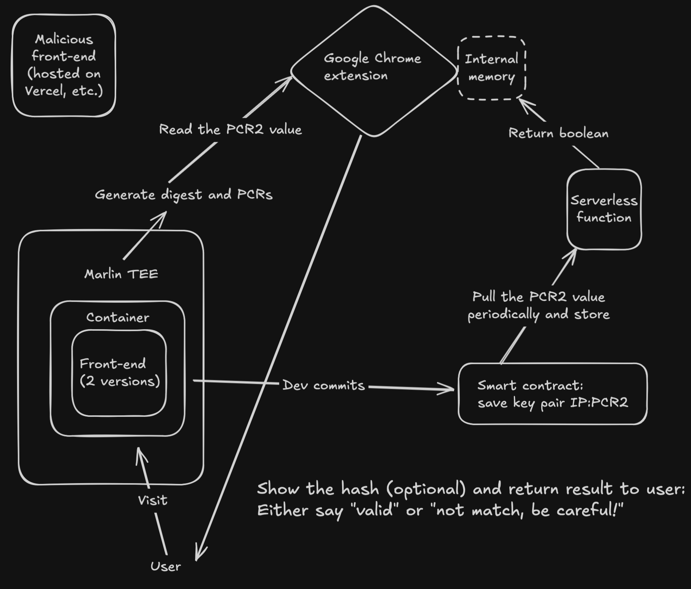
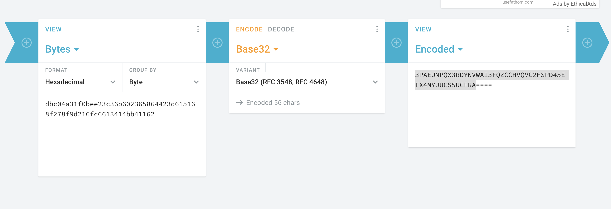

# ETHGlobal_Trifecta_2025_TEE_track

# TEE Shield
Protecting your front-end integrity, one dapp at a time!

## Summary
A decentralized frontend verification system that protects Web3 users from frontend tampering. By leveraging smart contracts, TEEs, and a browser extension, it ensures that users always interact with the authentic version of a dApp.

## Problem & opportunity
In Web3, dApps rely on frontends to interact with users, but these frontends are often hosted on centralized platforms like cloud servers or IPFS gateways. This creates a major security risk: malicious actors or even service providers can tamper with the frontend, inserting malicious code to deceive users (e.g., phishing, incorrect contract interactions, or fund redirection). Users currently have no trustless way to verify if they are interacting with the authentic frontend of a dApp.

## Flow of app
The diagram of the flow of different components: https://app.excalidraw.com/l/2Vdv2fRtWEm/85yNRoyIpL6

The flow of the app will be like following:
- The developers of the dapp commits the hash of the dapp into a public verified smart contract on-chain through our dashboard
- End user installs the Google Chrome extension in order to assist the user with verifying the integrity of the front-end sit
- End user visits the dapp (e.g. Safe Global site) front-end site run inside a TEE
- The Chrome extension periodically pings to get the value of the hash of the front-end site from the smart contract that the developers had committed
- When user visits the dapp, the Chrome extension would fetch the hash of the currrent site they're on.
- Afterwards, the Chrome extension would compare the two values: one fetched from the contract and one stored in the memory.
- If the hashes match, then the site is safe. If the hashes do not match, then the front-end site has been tampered. The extension will give the appropriate recommendation to the end user.

## Future Work
Some thoughts for how the whole project can be built out further:
- Productize this project so that other dapps can deploy their front-end in a TEE
- Implement a function to extract the value of the digest from the Enclave IP's attestation. It's too time-consuming and complex to be done in a weekend hackathon.
- Upgrade and add more features into the Chrome extension

## Deployed contracts (all verified)
### Arbitrum One mainnet  (chainID: 42161)
| Contract |                           Contract address |
| Front-end integrity |  |
Verified smart contract links:
Old: https://arbitrum.blockscout.com/address/0x3b53eb6FCc0b0a618db98F05BB4007aFcDbde94d?tab=read_contract


### Arbitrum Sepolia testnet (chainID: 421614)
| Contract    |                           Contract address |
| Front-end integrity | 0xE0b82507493e0e625f2659608142f1a8F11A31F1 |

The verified smart contract on Arbitrum Sepolia testnet is:
https://testnet.routescan.io/address/0xE0b82507493e0e625f2659608142f1a8F11A31F1/contract/421614/code

## How to run the entire project (locally)
Visit the respective README.md inside each folder to get the precise instructions.
For the Chrome extension, user can download it by following the instructions on the Chrome extension page.

For dashboard/landing page, go to the "frontend" folder and run these commands:
```
1. npm install --legacy-peer-deps
2. npm run dev
```
To deploy some front-end site to Marlin TEE, you would need to have some USDC on Arbitrum One.


### Steps for running the Backend & Serverless together

### Run the Backend locally
In the `Backend` folder, you will find a node backend, you just enter to the folder with your console, and run

```bash
node index.js
```

Once you have it running , you need to host this backend with Ngrok , because Marlin serverless service only accepts HTTPS requests.

```
ngrok http 3000
```

This URL ngrok gives you, you need to replace in `Serverless/DigestGetter.js`
on the `baseUrl` value

### Deploy the function
For test it on Arbitrum sepolia, go to the contract
https://sepolia.arbiscan.io/address/0x44fe06d2940b8782a0a9a9ffd09c65852c0156b1#writeContract

and there call the funcion `saveCodeInCallData`, the input is basically copy and paste the `DigestGetter.js` content.

once it is deployed, take the transaction hash
`0xdbc04a31f0bee23c36b602365864423d615168f278f9d216fc6613414bb41162`
and pass it through the page https://cryptii.com/pipes/hex-to-base32



paste it without the first 0x

copy the encoded value, and you can use it on the url

curl 3PAEUMPQX3RDYNVWAI3FQZCCHVQVC2HSPD45EFX4MYJUCS5UCFRA.oyster.run -d '{"host": "43.205.156.115"}' -v

you replace the ecoded value with your own one, and in the host, you put the ip provided by the frontend.
This function compares the pcr2 value read from the ip page, and the one stored in the contract.

### Local test
for local test, you can run the docker image that people from Marlin has
https://github.com/marlinprotocol/oyster-serverless-devtools?tab=readme-ov-file#test-serverless-js-function-locally

after follow the steps , in a terminal tab run

```
chmod +x mock_serverless.sh
sudo ./mock_serverless.sh 8090 <path-to-js-file>
```
the js file this one refers is where you should put the minify (or not, it is not really needed) script called digestGetter.js, which will be called next

and in other terminal run

```
curl http://0:8090/ -v -d '{"host": "13.201.207.60"}'
```

you must change here the ip host for the one you need to compare.


## Demo movie
https://youtu.be/xszZWFr7aDw

## Demo site
https://eth-global-trifecta-2025-ml47.vercel.app/
